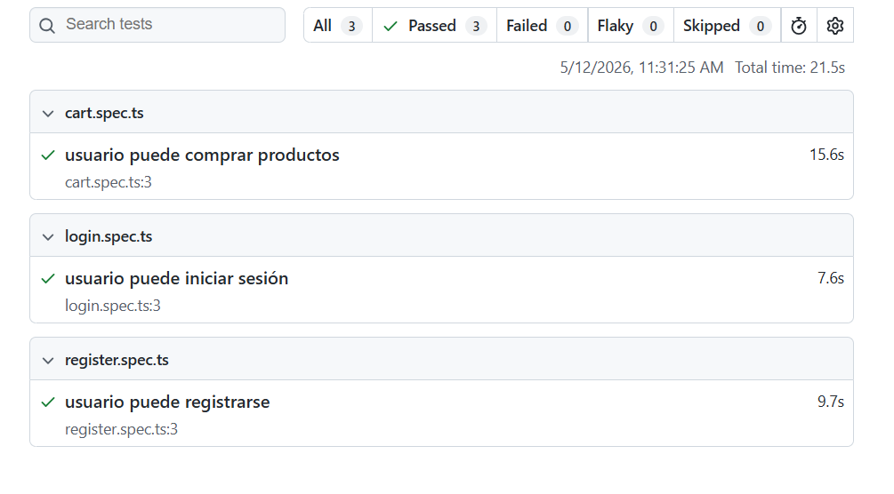
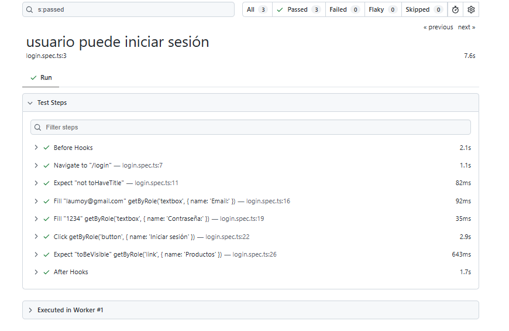
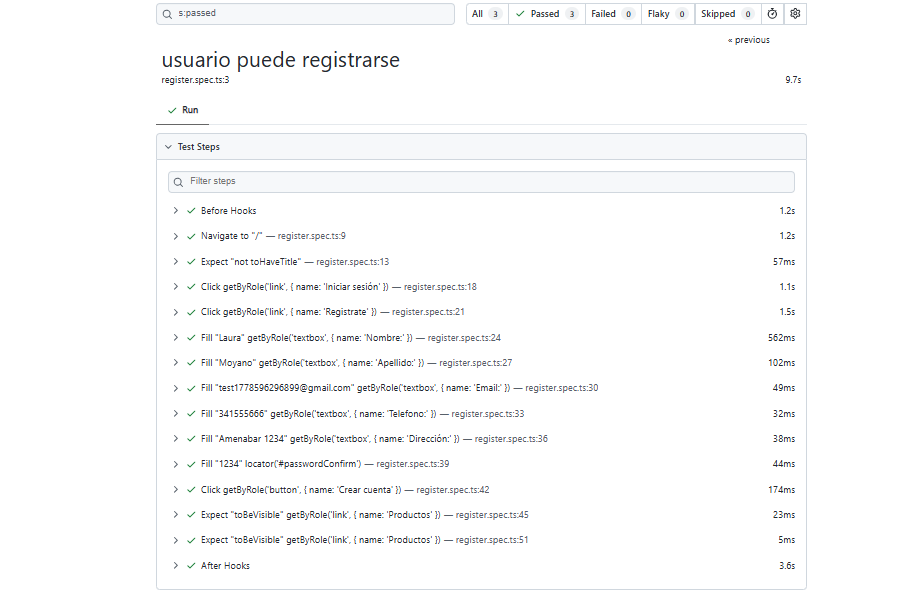
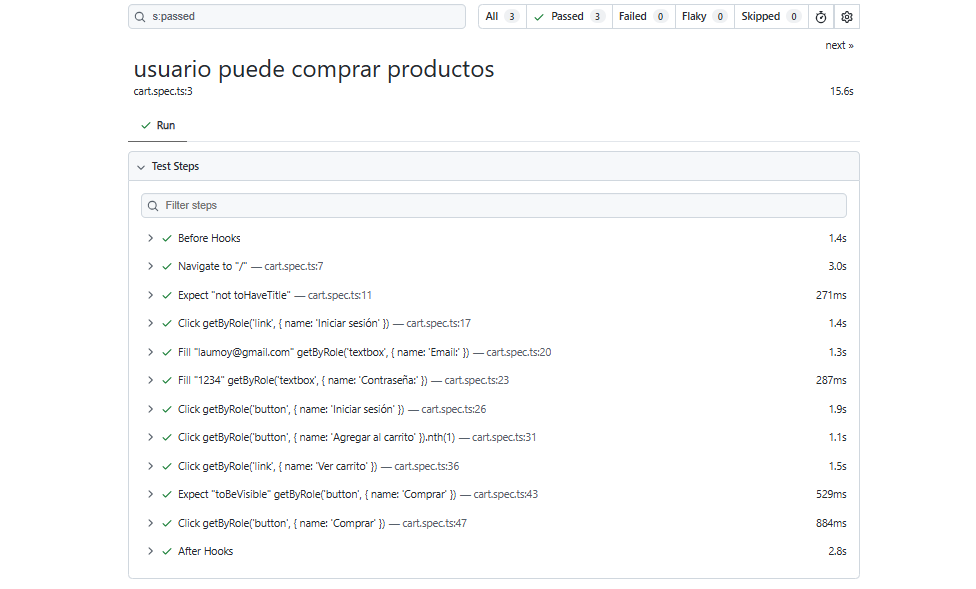

# QA Automation - Mateando TUP

## Tecnologías utilizadas
- Playwright
- TypeScript
- Node.js

## Escenarios automatizados
- Registro de usuario
- Login de usuario
- Agregado de productos al carrito
- Compra de productos

## Ejecución de tests

```bash
npx playwright test
```

## Ejecutar reporte HTML

```bash
npx playwright show-report
```

## Proyecto deployado

https://mateando-tup.onrender.com/

## Evidencia de ejecución

### Reporte Playwright



### Test Report


### Login Test


### Register Test


### Register Test